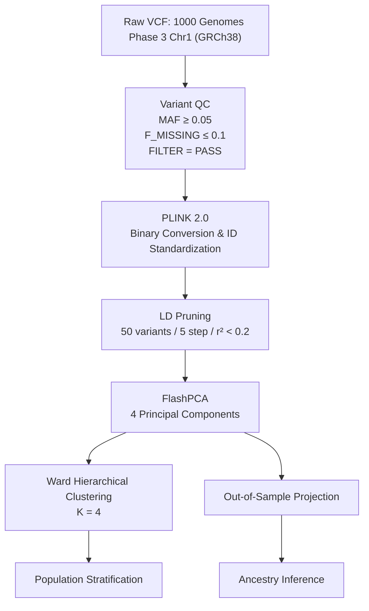
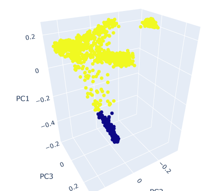
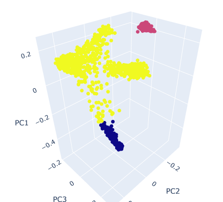
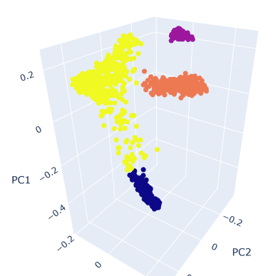
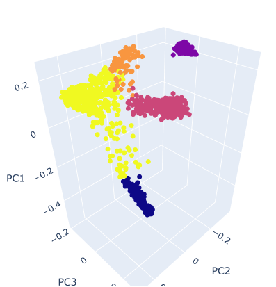
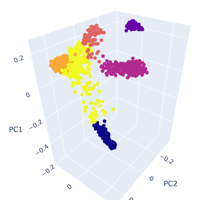
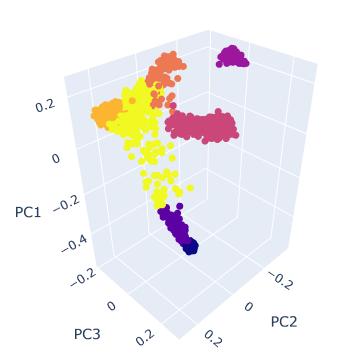
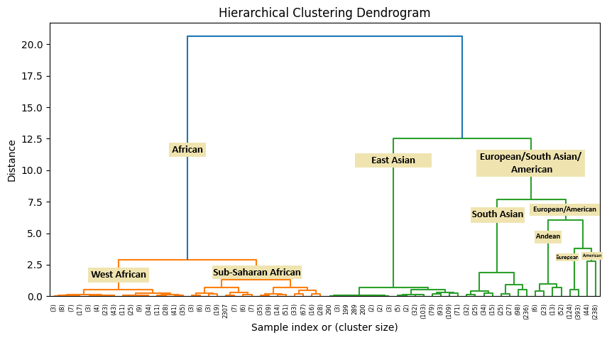

# Genomic Population Stratification and Ancestry Clustering

An end-to-end computational pipeline for **genomic preprocessing, dimensionality reduction, unsupervised population stratification, and ancestry-aware model inference** using whole-genome variation data from the **1000 Genomes Project Phase 3**.

The workflow is implemented in [`Preprocessing_&_Training.ipynb`](Preprocessing_&_Training.ipynb) and uses phased single-nucleotide variants (SNVs) and indels from **Chromosome 1 (GRCh38)**. The analysis proceeds from variant-level quality control and linkage-disequilibrium (LD) pruning to principal component analysis (PCA), hierarchical clustering, and out-of-sample inference.

The primary objective is to investigate whether population structure can be recovered from genotype variation without explicitly using population labels during clustering, and subsequently construct a computationally efficient framework for assigning new samples to the learned population structure.

---

## 1. Overview

Genetic variation is strongly structured by population history, geographic origin, migration, and demographic events. Principal component analysis (PCA) provides a widely used representation of this structure, while clustering methods can subsequently identify groups of genetically similar individuals.

In this work, we construct the following pipeline:



The resulting representation consists of four principal components, followed by Ward's agglomerative hierarchical clustering. The optimal number of clusters was investigated empirically using silhouette analysis.

---

## 2. Dataset

The primary dataset is the **1000 Genomes Project Phase 3**, using the phased GRCh38 Chromosome 1 callset.

### Input data

| File                                                                       | Description                                                                        |
| :------------------------------------------------------------------------- | :--------------------------------------------------------------------------------- |
| `ALL.chr1.shapeit2_integrated_snvindels_v2a_27022019.GRCh38.phased.vcf.gz` | Phased SNV and indel callset for Chromosome 1                                      |
| `1000genomes_phase3.tsv`                                                   | Sample identifiers, population labels, and continental superpopulation annotations |

The analysis ultimately retained **2,530 individuals** for which PCA coordinates could be successfully matched with population metadata.

The current implementation uses **Chromosome 1** as a proof-of-concept. A genome-wide implementation using chromosomes 1–22 is planned for subsequent evaluation, particularly when testing generalization to external datasets.

---

## 3. Computational Environment

The principal command-line tools used throughout the preprocessing and dimensionality-reduction stages are:

| Tool / Library | Version / Source                | Primary Role                                                   |
| :------------- | :------------------------------ | :------------------------------------------------------------- |
| **bcftools**   | Ubuntu package                  | VCF indexing and variant-level quality filtering               |
| **PLINK 2.0**  | `plink-ng` compiled from source | Genotype conversion, variant normalization, LD pruning, and QC |
| **FlashPCA**   | v2.0, x86_64 binary             | PCA computation and out-of-sample projection                   |
| **Python**     | —                               | Scaling, clustering, evaluation, and inference                 |

---

# 4. Genomic Preprocessing

## 4.1 Variant-Level Quality Control

Three sequential filters were applied using `bcftools`.

### Minor Allele Frequency

Variants with minor allele frequency below 5% were excluded:

```bash
bcftools view -i 'MAF>=0.05' \
    -Oz \
    -o ALL.chr1.filtered.vcf.gz \
    <input_vcf>
```

This retains relatively common variants and reduces the influence of rare variants in the subsequent population-structure analysis.

### Genotype Missingness

Variants with more than 10% missing genotypes were removed:

```bash
bcftools view -i 'F_MISSING<=0.1' \
    -Oz \
    -o ALL.chr1.filtered2.vcf.gz \
    ALL.chr1.filtered.vcf.gz
```

### Variant Quality Status

Only variants whose VCF `FILTER` field was `PASS` were retained:

```bash
bcftools view -f PASS \
    -Oz \
    -o ALL.chr1.filtered_Pass.vcf.gz \
    ALL.chr1.filtered2.vcf.gz
```

Thus, the principal variant-level inclusion criteria were:

$$
\mathrm{MAF} \geq 0.05,
\qquad
F_{\mathrm{missing}} \leq 0.10,
\qquad
\mathrm{FILTER} = \mathrm{PASS}
$$

---

# 5. Genotype Representation and LD Pruning

## 5.1 PLINK Conversion

The filtered VCF was converted into PLINK binary format:

```bash
plink2 \
    --vcf ALL.chr1.filtered_Pass.vcf.gz \
    --make-bed \
    --out data_filtered
```

This produces the standard `.bed`, `.bim`, and `.fam` representation.

## 5.2 Variant Identifier Standardization

Variant identifiers were normalized to a chromosome-position-reference-allele representation:

```bash
plink2 \
    --bfile data_filtered \
    --set-all-var-ids '@#:$1:$2' \
    --new-id-max-allele-len 120 truncate \
    --make-bed \
    --out data_unique_ids
```

This provides consistent identifiers for downstream processing and projection.

## 5.3 Linkage Disequilibrium Pruning

Highly correlated variants provide partially redundant information and can disproportionately influence PCA. Therefore, LD pruning was performed using:

```bash
plink2 \
    --bfile data_unique_ids \
    --indep-pairwise 50 5 0.2 \
    --out pruned
```

The parameters were:

* **Window:** 50 variants
* **Step size:** 5 variants
* **LD threshold:** (r^2 < 0.2)

Variants exceeding the pairwise correlation threshold within each sliding window were pruned, producing:

```text
pruned.prune.in
```

The resulting independent variants were extracted into a new dataset:

```bash
plink2 \
    --bfile data_unique_ids \
    --extract pruned.prune.in \
    --make-bed \
    --out data_pruned
```

Additional population-genetic quality-control statistics were calculated:

```bash
plink2 --bfile data_pruned --freq --out freq_stats
plink2 --bfile data_pruned --hardy --out hwe_stats
plink2 --bfile data_pruned --het --out het_stats
```

These provide allele-frequency, Hardy–Weinberg equilibrium, and heterozygosity statistics for inspection of the processed genotype data.

---

# 6. Principal Component Analysis

PCA was performed using **FlashPCA 2.0** on the LD-pruned genotype matrix:

```bash
flashpca \
    --bfile data_pruned \
    --ndim 4 \
    --outpc pca_scores.txt \
    --outvec pca_vectors.txt \
    --outval pca_values.txt \
    --outload pca_loadings.txt \
    --outmeansd pca_meansd.txt
```

The generated artifacts include:

| File               | Description                               |
| :----------------- | :---------------------------------------- |
| `pca_scores.txt`   | Coordinates of individuals in PCA space   |
| `pca_vectors.txt`  | Principal-component eigenvectors          |
| `pca_values.txt`   | Eigenvalues                               |
| `pca_loadings.txt` | Variant-level PCA loadings                |
| `pca_meansd.txt`   | Per-variant means and standard deviations |

### Selection of PCA dimensionality

The number of principal components was not selected arbitrarily. PCA was initially evaluated over the first **20 components**, and the variance profile exhibited an elbow around **PC4**. Consequently, four principal components were retained for population-stratification analysis.

The resulting representation of each individual is therefore:

$$
\mathbf{x}_i =
[
PC_1, PC_2, PC_3, PC_4
].
$$

These four dimensions capture the dominant axes of genetic variation while substantially reducing the dimensionality of the original genotype matrix.

---

# 7. Population Stratification

Population structure was inferred using **agglomerative hierarchical clustering** with **Ward's minimum-variance criterion**.

Ward's method recursively merges clusters while minimizing the increase in within-cluster variance. For two candidate clusters (u) and (v), the Ward distance can be expressed as:

$$
d(u,v) =
\sqrt{
\frac{|u||v|}
{|u|+|v|}
}
\left\|
\mathbf{c}_u-\mathbf{c}_v
\right\|_2
$$

where (|u|) and (|v|) denote cluster sizes and $\mathbf{c}_u$ and $\mathbf{c}_v$ represent their centroids.

The clustering was evaluated for:

$$
K \in {2,3,4,5,6,7}.
$$

### Silhouette analysis

| Number of clusters | Silhouette score |
| :----------------: | ---------------: |
|          2         |           0.5969 |
|          3         |           0.6403 |
|        **4**       |       **0.7285** |
|          5         |           0.7180 |
|          6         |           0.7165 |
|          7         |           0.6743 |

The highest silhouette score was obtained at **(K=4)**:

$$
\boxed{S=0.7285}
$$

Accordingly, four clusters were selected as the principal population-stratification solution.

---

## 8. Population Structure Across Different Cluster Numbers

To investigate the hierarchical organization of the inferred population structure, 
agglomerative clustering was evaluated for six different numbers of clusters 
$\(K=2,\ldots,7\)$. The corresponding three-dimensional PCA projections are shown below.

### K = 2

<div align="center">
  
  <p><b>Figure 1:</b> Three-dimensional PCA representation of the population structure with $K=2$ hierarchical clusters.</p>
</div>

### K = 3

<div align="center">
  
  <p><b>Figure 2:</b> Three-dimensional PCA representation of the population structure with $K=3$ hierarchical clusters.</p>
</div>

### K = 4

<div align="center">
  
  <p><b>Figure 3:</b> Three-dimensional PCA representation of the population structure with $K=4$ hierarchical clusters.</p>
</div>

### K = 5

<div align="center">
  
  <p><b>Figure 4:</b> Three-dimensional PCA representation of the population structure with $K=5$ hierarchical clusters.</p>
</div>

### K = 6

<div align="center">
  
  <p><b>Figure 5:</b> Three-dimensional PCA representation of the population structure with $K=6$ hierarchical clusters.</p>
</div>

### K = 7

<div align="center">
  
  <p><b>Figure 6:</b> Three-dimensional PCA representation of the population structure with $K=7$ hierarchical clusters.</p>
</div>

The sequence of projections illustrates the hierarchical nature of the inferred
population structure. As the number of clusters increases, existing groups are
progressively subdivided rather than entirely reorganized. This behavior is
consistent with the agglomerative hierarchical clustering procedure and provides
a visual explanation for the changes in silhouette score across different values
of $K$.

The highest silhouette score was obtained at $K=4$, with a score of **0.7285**,
and this configuration was therefore selected as the primary population
stratification solution.

<div align="center">
  
  <p><b>Figure 7:</b> Ward hierarchical-clustering dendrogram showing the hierarchical relationships among the inferred population groups.</p>
</div>

---

# 9. Population-Stratification Results

To interpret the unsupervised clusters biologically, cluster assignments were cross-tabulated against the known 1000 Genomes continental **superpopulation** annotations.

Among the 2,530 individuals retained for analysis:

|    Cluster    | African (AFR) | American (AMR) | East Asian (EAS) | European (EUR) | South Asian (SAS) |     Total | Dominant ancestry                       |
| :-----------: | ------------: | -------------: | ---------------: | -------------: | ----------------: | --------: | :-------------------------------------- |
| **Cluster 1** |             0 |              0 |          **508** |              0 |                 0 |   **508** | **East Asian (100.0%)**                 |
| **Cluster 2** |       **657** |              3 |                0 |              0 |                 0 |   **660** | **African (99.55%)**                    |
| **Cluster 3** |             0 |              0 |                0 |              0 |           **492** |   **492** | **South Asian (100.0%)**                |
| **Cluster 4** |             9 |        **344** |                0 |        **517** |                 0 |   **870** | **European (59.4%) / American (39.5%)** |
|   **Total**   |       **666** |        **347** |          **508** |        **517** |           **492** | **2,530** | —                                       |

The resulting structure closely corresponds to the known continental superpopulation labels, despite these labels not being used to construct the clusters.

---

# 10. Interpretation

### Cluster 1 — East Asian

All **508 EAS individuals** were assigned to Cluster 1:

$$
508/508 = 100%.
$$

This indicates highly consistent separation of the East Asian samples in the four-dimensional PCA representation.

### Cluster 2 — African

Cluster 2 contained **657 of 666 African individuals**, corresponding to:

$$
\frac{657}{660}\times100 \approx 99.55%.
$$

Only three AMR individuals were assigned to this cluster.

### Cluster 3 — South Asian

All **492 South Asian individuals** were assigned to Cluster 3:

$$
492/492 = 100%.
$$

This represents another clearly separated population group.

### Cluster 4 — European and American

Cluster 4 contains all **517 EUR individuals**, together with **344 of 347 AMR individuals** and nine AFR individuals.

This mixed structure is biologically plausible given the substantial European ancestry component present in the American populations represented in the 1000 Genomes Project. At (K=4), the hierarchical clustering therefore captures a broad European/American genetic component rather than separating these populations into independent clusters.

Importantly, these observations are interpretations of the clustering structure relative to the provided 1000 Genomes annotations; the annotations themselves were not used as input features for the unsupervised clustering.

---

# 11. Limitations and Future Work

Several limitations should be considered when interpreting the current results.

### 11.1 Chromosome 1 only

The current analysis uses **Chromosome 1** rather than the complete autosomal genome. Although chromosome 1 contains substantial genetic information, population inference based on a single chromosome may not fully represent genome-wide ancestry.

A major next step is therefore to extend the pipeline to **chromosomes 1–22** and construct a genome-wide representation.

### 11.2 Evaluation without an independent test split

The current clustering analysis uses the available 1000 Genomes individuals as a single reference cohort. Although the clustering itself is unsupervised, a more rigorous assessment of the inference model should separate the data into reference/training and independent test sets.

Future experiments should evaluate:

* training/reference versus held-out individuals;
* inference accuracy on unseen 1000 Genomes samples;
* robustness across populations;
* sensitivity to different variant-filtering thresholds;
* generalization to independent external datasets.

### 11.3 External-dataset validation

External validation is particularly important for determining whether the learned PCA representation and clustering structure generalize beyond the 1000 Genomes cohort.

A genome-wide model trained on chromosomes 1–22 should therefore be evaluated on independent datasets collected using different cohorts, sequencing technologies, and experimental protocols.

### 11.4 Cluster labels versus biological ancestry

The inferred clusters represent statistical structure in the genotype data rather than definitive biological categories. Population boundaries are continuous and reflect complex demographic histories. In particular, mixed clusters such as the European/American group illustrate why clustering labels should not automatically be interpreted as discrete ancestral identities.

---

## Citation and Data Attribution

This project uses data from the **1000 Genomes Project Phase 3**. Users of the repository should cite the original 1000 Genomes Project publication and comply with the dataset's terms of use.

The computational workflow is provided for research and educational purposes.
